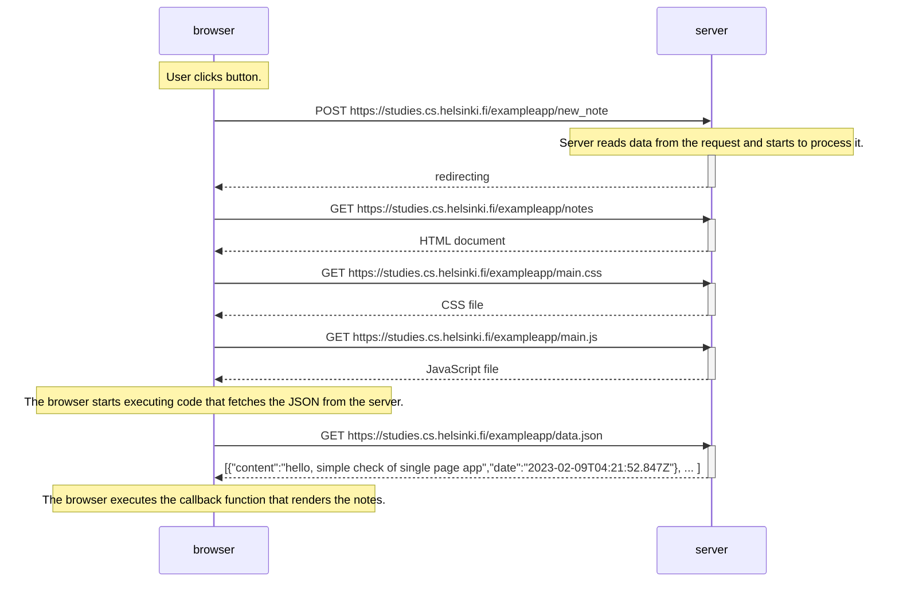
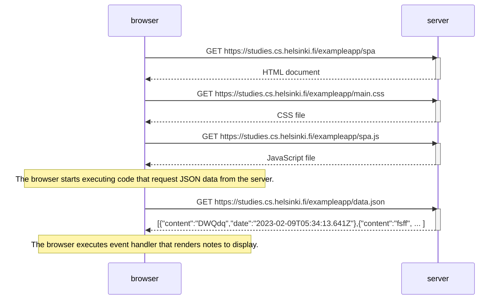
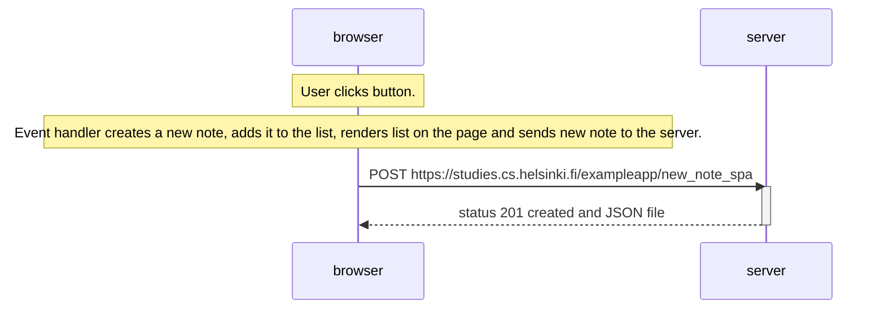

## New note diagram

```mermaid
sequenceDiagram
    participant browser
    participant server

Note over browser: User clicks button.
browser->>server: POST https://studies.cs.helsinki.fi/exampleapp/new_note
Note over server: Server reads data from the request and starts to process it.
activate server
server-->>browser: redirecting
deactivate server

browser->>server: GET https://studies.cs.helsinki.fi/exampleapp/notes
activate server
server-->>browser: HTML document
deactivate server

browser->>server: GET https://studies.cs.helsinki.fi/exampleapp/main.css
activate server
server-->>browser: CSS file
deactivate server

browser->>server: GET https://studies.cs.helsinki.fi/exampleapp/main.js
activate server
server-->>browser: JavaScript file
deactivate server
Note over browser: The browser starts executing code that fetches the JSON from the server.

browser->>server: GET https://studies.cs.helsinki.fi/exampleapp/data.json
activate server
server-->>browser: [{"content":"hello, simple check of single page app","date":"2023-02-09T04:21:52.847Z"}, ... ]
deactivate server
Note over browser: The browser executes the callback function that renders the notes.
```

## Single page app diagram

```mermaid
sequenceDiagram
    participant browser
    participant server

browser->>server: GET https://studies.cs.helsinki.fi/exampleapp/spa
activate server
server-->>browser: HTML document
deactivate server

browser->>server: GET https://studies.cs.helsinki.fi/exampleapp/main.css
activate server
server-->>browser: CSS file
deactivate server

browser->>server: GET https://studies.cs.helsinki.fi/exampleapp/spa.js
activate server
server-->>browser: JavaScript file
deactivate server
Note over browser: The browser starts executing code that request JSON data from the server.

browser->>server: GET https://studies.cs.helsinki.fi/exampleapp/data.json
activate server
server-->>browser: [{"content":"DWQdq","date":"2023-02-09T05:34:13.641Z"},{"content":"fsff", ... ]
deactivate server
Note over browser: The browser executes event handler that renders notes to display.
```

## New note in single page app diagram

```mermaid
sequenceDiagram
    participant browser
    participant server

Note over browser: User clicks button.
Note over browser: Event handler creates a new note, adds it to the list, renders list on the page and sends new note to the server.
browser->>server: POST https://studies.cs.helsinki.fi/exampleapp/new_note_spa
activate server
server-->>browser: status 201 created and JSON file
deactivate server
```